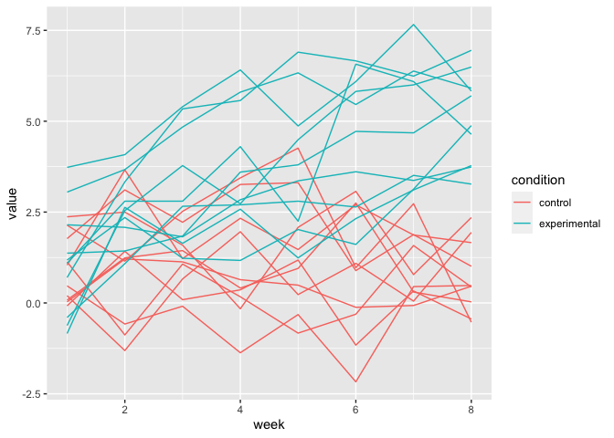

Homework 5
================

##### Import Packages

``` r
library(ggplot2)
library(dplyr)
```

    ## 
    ## Attaching package: 'dplyr'

    ## The following objects are masked from 'package:stats':
    ## 
    ##     filter, lag

    ## The following objects are masked from 'package:base':
    ## 
    ##     intersect, setdiff, setequal, union

``` r
library(purrr)
library(tidyverse)
```

    ## ── Attaching packages ─────────────────────────────────────── tidyverse 1.3.2 ──

    ## ✔ tibble  3.1.8     ✔ stringr 1.4.0
    ## ✔ tidyr   1.2.1     ✔ forcats 0.5.2
    ## ✔ readr   2.1.2

    ## Warning: package 'readr' was built under R version 4.0.5

    ## ── Conflicts ────────────────────────────────────────── tidyverse_conflicts() ──
    ## ✖ dplyr::filter() masks stats::filter()
    ## ✖ dplyr::lag()    masks stats::lag()

### Problem 1

This zip file contains data from a longitudinal study that included a
control arm and an experimental arm. Data for each participant is
included in a separate file, and file names include the subject ID and
arm.

Create a tidy dataframe containing data from all participants, including
the subject ID, arm, and observations over time:

-   Start with a dataframe containing all file names; the list.files
    function will help
-   Iterate over file names and read in data for each subject using
    purrr::map and saving the result as a new variable in the dataframe
-   Tidy the result; manipulate file names to include control arm and
    subject ID, make sure weekly observations are “tidy”, and do any
    other tidying that’s necessary

``` r
# read in files in data folder
filenames <- list.files("data/problem-1", pattern="*.csv", full.names=TRUE)
filenames
```

    ##  [1] "data/problem-1/con_01.csv" "data/problem-1/con_02.csv"
    ##  [3] "data/problem-1/con_03.csv" "data/problem-1/con_04.csv"
    ##  [5] "data/problem-1/con_05.csv" "data/problem-1/con_06.csv"
    ##  [7] "data/problem-1/con_07.csv" "data/problem-1/con_08.csv"
    ##  [9] "data/problem-1/con_09.csv" "data/problem-1/con_10.csv"
    ## [11] "data/problem-1/exp_01.csv" "data/problem-1/exp_02.csv"
    ## [13] "data/problem-1/exp_03.csv" "data/problem-1/exp_04.csv"
    ## [15] "data/problem-1/exp_05.csv" "data/problem-1/exp_06.csv"
    ## [17] "data/problem-1/exp_07.csv" "data/problem-1/exp_08.csv"
    ## [19] "data/problem-1/exp_09.csv" "data/problem-1/exp_10.csv"

``` r
#create a combines dataframe
combo_data <- map_df(filenames, read.csv,stringsAsFactors = FALSE, .id = 'filename') %>%
  mutate(filename = substr(filenames,16,21)) %>% #shorten filename variable
  mutate(condition = substr(filenames,16,18), # add condition variable
                condition = recode(condition, "con" = "control", "exp" = "experimental"),
                condition = factor(condition)) %>%
  janitor::clean_names()

#tidy the dataset, longer format
combo_tidy_data <- pivot_longer(combo_data, week_1:week_8, 
    names_to = "week", 
    names_prefix = "week_",
    values_to = "value") %>%
    mutate(week = as.numeric(week))
```

-   Make a spaghetti plot showing observations on each subject over
    time, and comment on differences between groups.

``` r
p <- ggplot(data = combo_tidy_data, aes(x = week, y = value, color = condition, group = filename))
p + geom_line()
```

<!-- --> Looking at
the plot we can see differences in the trends between the control and
experimental groups across weeks of the study.

Both control and experimental particpants began the study in a similar
value in week 0. Values for participants in the control group remain in
a relatively consistent across the 8 weeks of the study. Values for
participants in the experimental group appear to trend upward across
weeks of the study.

### Problem 2

The Washington Post has gathered data on homicides in 50 large U.S.
cities and made the data available through a GitHub repository.

###### Raw Data Description:

The file consists of information for 52,179 homicide victims from 2010
to 2013. For each victim, the file contains information across 12
variables including their name, sex, the date the homicide was reported,
the city, the state, region (latitude and longitude), and legal case
status (disposition).

``` r
# read in homicides file
homicides_df <- read.csv("data/problem-2/homicide-data.csv")
```

Create a city\_state variable (e.g. “Baltimore, MD”) and then summarize
within cities to obtain the total number of homicides and the number of
unsolved homicides (those for which the disposition is “Closed without
arrest” or “Open/No arrest”).

For the city of Baltimore, MD, use the prop.test function to estimate
the proportion of homicides that are unsolved; save the output of
prop.test as an R object, apply the broom::tidy to this object and pull
the estimated proportion and confidence intervals from the resulting
tidy dataframe.

Now run prop.test for each of the cities in your dataset, and extract
both the proportion of unsolved homicides and the confidence interval
for each. Do this within a “tidy” pipeline, making use of purrr::map,
purrr::map2, list columns and unnest as necessary to create a tidy
dataframe with estimated proportions and CIs for each city.

Create a plot that shows the estimates and CIs for each city – check out
geom\_errorbar for a way to add error bars based on the upper and lower
limits. Organize cities according to the proportion of unsolved
homicides.

``` r
test = function( ){
  
  #BODY OF THE FUNCTION
}
```

### Problem 3

When designing an experiment or analysis, a common question is whether
it is likely that a true effect will be detected – put differently,
whether a false null hypothesis will be rejected. The probability that a
false null hypothesis is rejected is referred to as power, and it
depends on several factors, including: the sample size; the effect size;
and the error variance. In this problem, you will conduct a simulation
to explore power in a one-sample t-test.

First set the following design elements:

-   Fix n=30
-   Fix σ=5
-   Set μ=0. Generate 5000 datasets from the model

x∼Normal\[μ,σ\]

For each dataset, save μ̂ and the p-value arising from a test of H:μ=0
using α=0.05. Hint: to obtain the estimate and p-value, use broom::tidy
to clean the output of t.test.

Repeat the above for μ={1,2,3,4,5,6}, and complete the following:

1.  Make a plot showing the proportion of times the null was rejected
    (the power of the test) on the y axis and the true value of μ on the
    x axis.

*Describe the association between effect size and power.*

2.  Make a plot showing the average estimate of μ̂ on the y axis and the
    true value of μ on the x axis. Make a second plot (or overlay on the
    first) the average estimate of μ̂ only in samples for which the null
    was rejected on the y axis and the true value of μ on the x axis.

*Is the sample average of μ̂ across tests for which the null is rejected
approximately equal to the true value of μ? Why or why not?*
